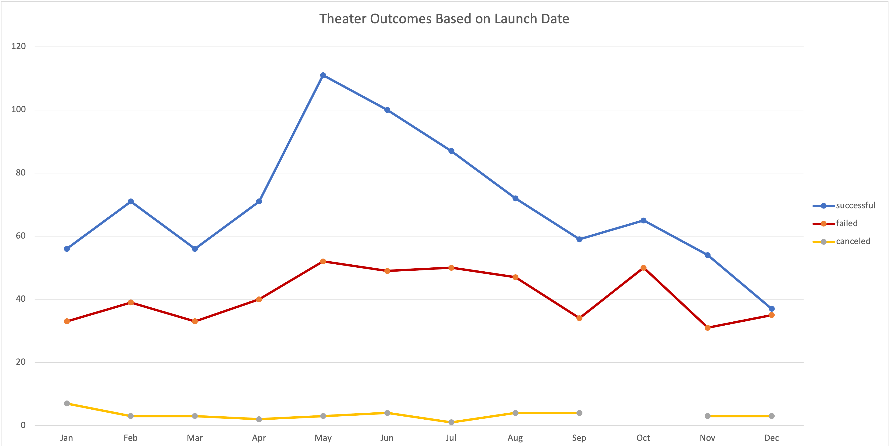

# **Kickstarter-analysis**
## Overview

An analysis of Kickstarter campaigns was completed to help Louise make a decision on when she should launch her own campaign. 

### Purpose 

This analysis was completed to show Louise how Kickstarter theater campaigns, specifically plays, performed in relations to their launch and funding goals. The analysis will provide her with information on what time of the year is best to launch and what amount of money she should ask for in relation to successful funding.

## Analysis and Challenges

The analysis shows that Louise should start a campaign in May or June and the campaign should be between $1000 to $20000 to have best chance and being successful.

### Analysis of Outcomes Based on Launch Date

Theater outcomes for the US based on launch date shows that Louise would be more successful is she launched her campaign in May. May shows to be the most successful month of the year and December shows to be the least successful.

### Analysis of Outcomes Based on Goals

We can see from the chart below that Kickstarter campaign success begins to fall as you ask for more money. From less than $1,000 up to about $20,000 there is a 50% chance or better to achieve your goal but after that you are more likely to fail. Although towards the back the higher amounts there seems to be success, we do not have enough data to make a decision as there are not enough campaigns.

### Chalenges and Difficulties Encountered

Although we had an enormous amount of data, I believe we could have gotten deeper into it to get a better understanding of how we can filter through it to make a better decision. We were also limited in terms of the subcategory because we were able to filter it down to plays, but what type of plays were they? If we had more data on the types of plays and compared that to Louise’s we can get a better answer for her. We can also focus on the area of the country that she is in, the genre of the play. There are many other categories that we could dive into and I think she would have gotten a better analysis. 

## Results

I would tell Louise based on the data that we have to launch her Kickstarter campaign in May or June to have the highest rate of success and to keep the goals between the amounts of $1,000 to $20,000. She should have a higher rate of success if she stays within these ranges.
