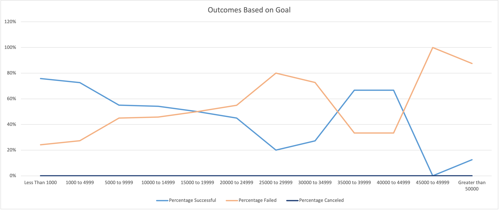

# **Kickstarter-analysis**
## Overview
An analysis of Kickstarter campaigns was completed to help Louise make a deciion on when she should lauch her own campaign. 
### Purpose 
This analysis was completed to show Louise how Kickstarter theater campaigns, specifically plays, performed in relations to their lauch and funding goals. The analysis will provide her with information on what time of the year is best to launch and what amount of money she should ask for in relation to sucessful funding.

## Analysis and Challenges
The analysis shows that Louise should start a campaing in May or June and the campain should be between $1000 to $20000 to have best chance and being sucessful.
### Analysis of Outocomes Based on Launch Date
Theater outcomes for the US based on launch date shows that Louise would be more succefull is she launched her campaign in May. May shows to be the most succesful month of the year and Decemnber shows to be the least successful. 
![](
We can see from the chart below that Kickstarter campaign success begins to fall as you ask for more money. From less than $1,000 up to about $20,000 their is a 50% chance or better to acheive your goal but after that you are more likely to fail. Althouhg towards the back the higher amounts there seems to be success we do not have enough data to make a decision as there are not enouhg campaigns.

